# vizcrush Architecture & Workflow Diagrams

## 1. High-Level Data Flow

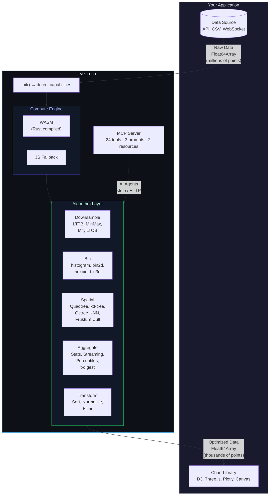

## 2. Compute Backend Selection

Only two paths are real: WASM (one SIMD-enabled binary, always built — there is
no separate scalar build) and the pure-JS core. There is no WebGPU compute
path; `detectCapabilities()` still probes `navigator.gpu` for reporting, but
`selectBackend()` never returns it (see `packages/core/src/types.ts` and ADR
0002/0003, which found WASM's real advantage to be engine-dependent, not a
GPU-vs-CPU story).

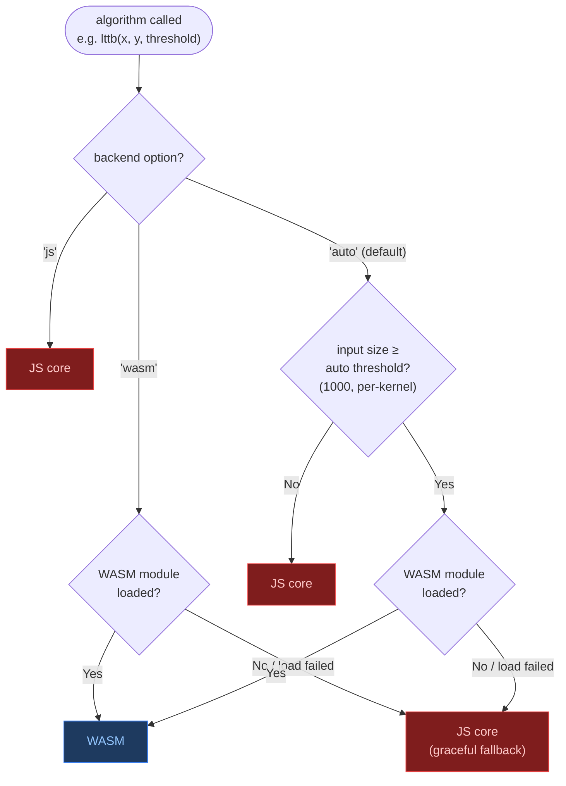

## 3. WASM Module Loading

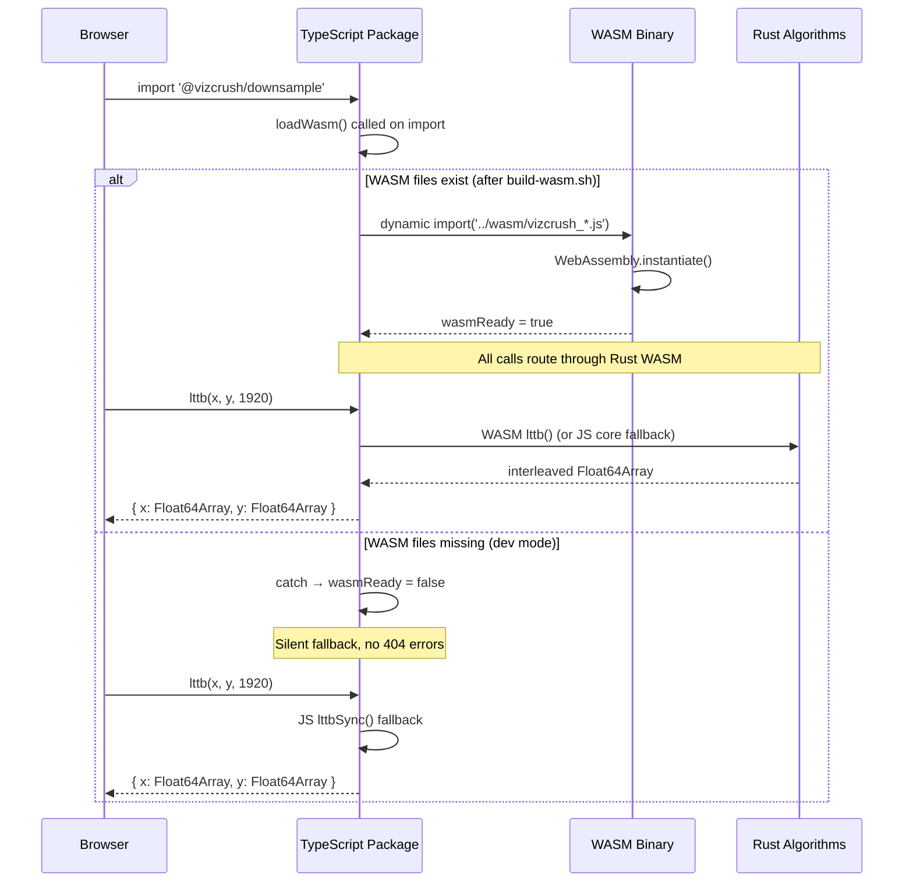

## 4. LTTB Downsampling Algorithm

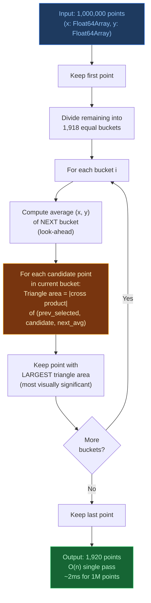

## 5. Octree Build & Query

```mermaid
flowchart TD
    subgraph BUILD["BUILD (one-time, ~200ms @ 500K)"]
        B1["500K 3D points"] --> B2["Find bounds<br/>Add padding"]
        B2 --> B3["Root node<br/>contains all points"]
        B3 --> B4{"Points > 64?"}
        B4 -->|Yes| B5["Split into 8 octants<br/>(2³ = 8 children)"]
        B5 --> B4
        B4 -->|No| B6["Leaf node<br/>Store point indices"]
    end

    subgraph RANGE["RANGE QUERY (<1ms)"]
        R1["Query box:<br/>(xMin,xMax,yMin,yMax,zMin,zMax)"] --> R2{"Box intersects<br/>node bounds?"}
        R2 -->|No| R3["🚫 SKIP<br/>entire subtree"]
        R2 -->|Yes| R4{"Box fully<br/>contains node?"}
        R4 -->|Yes| R5["✅ RETURN<br/>all points in subtree"]
        R4 -->|No| R6["Check individual<br/>points + recurse<br/>into children"]
    end

    subgraph KNN["kNN QUERY (0.3ms)"]
        K1["Query point (px,py,pz)<br/>k = 10"] --> K2["Search nearer<br/>child first"]
        K2 --> K3["Update candidate<br/>list + max distance"]
        K3 --> K4{"Split plane<br/>closer than<br/>best candidate?"}
        K4 -->|Yes| K5["Search farther<br/>child too"]
        K4 -->|No| K6["🚫 PRUNE<br/>farther child"]
    end

    style BUILD fill:#1e3a5f,stroke:#3b82f6,color:#93c5fd
    style RANGE fill:#166534,stroke:#22c55e,color:#bbf7d0
    style KNN fill:#4c1d95,stroke:#8b5cf6,color:#ddd6fe
```

## 6. LOD (Level of Detail) Pipeline

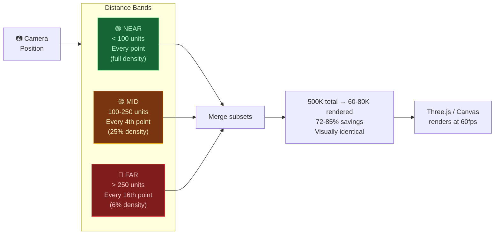

## 7. WGSL Shaders (One Wired, Four Drafts)

Five `.wgsl` compute shaders live alongside the TypeScript source:

- `packages/bin/src/shaders/bin2d.wgsl` — **wired** as an opt-in compute path
  (`bin2d(..., { backend: "webgpu" })`, silent fallback to wasm/js). Measured
  correct but ~15× slower than WASM at every tested size on Apple
  Silicon/Metal — see ADR 0004; it is never auto-selected.
- `packages/bin/src/shaders/hexbin.wgsl`
- `packages/bin3d/src/shaders/bin3d.wgsl`
- `packages/spatial/src/shaders/quadtree.wgsl`
- `packages/spatial3d/src/shaders/octree-morton.wgsl`

The four drafts are design sketches only — nothing compiles or dispatches
them. Default compute always runs on WASM or the JS core, as shown in
section 2; `webgpu` is a per-call request on bin2d, never a selected
backend (ADR 0002/0004).

## 8. MCP Server Architecture

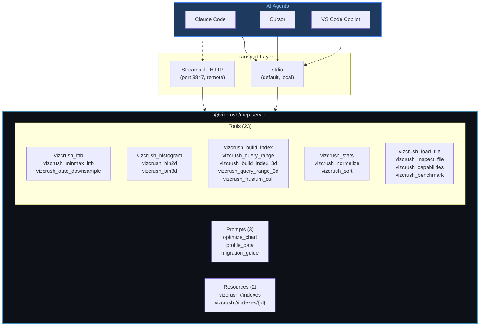

## 9. Package Dependency Graph

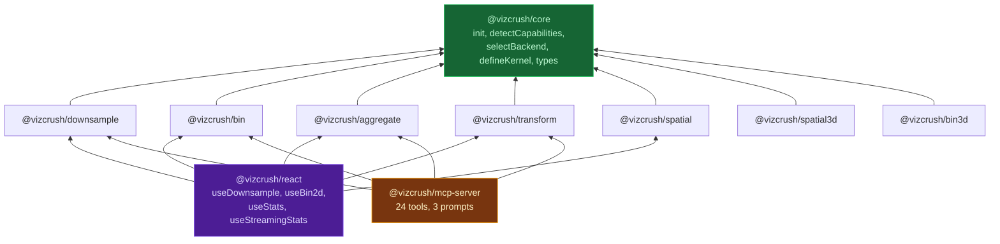

## 10. Rust Crate Dependency Graph

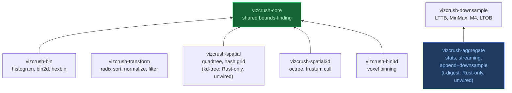

## 11. Build Pipeline

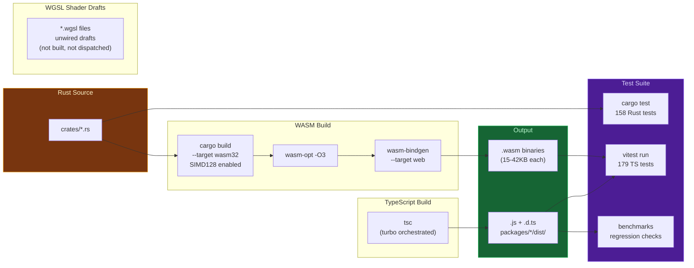

## 12. Three.js Integration Pattern

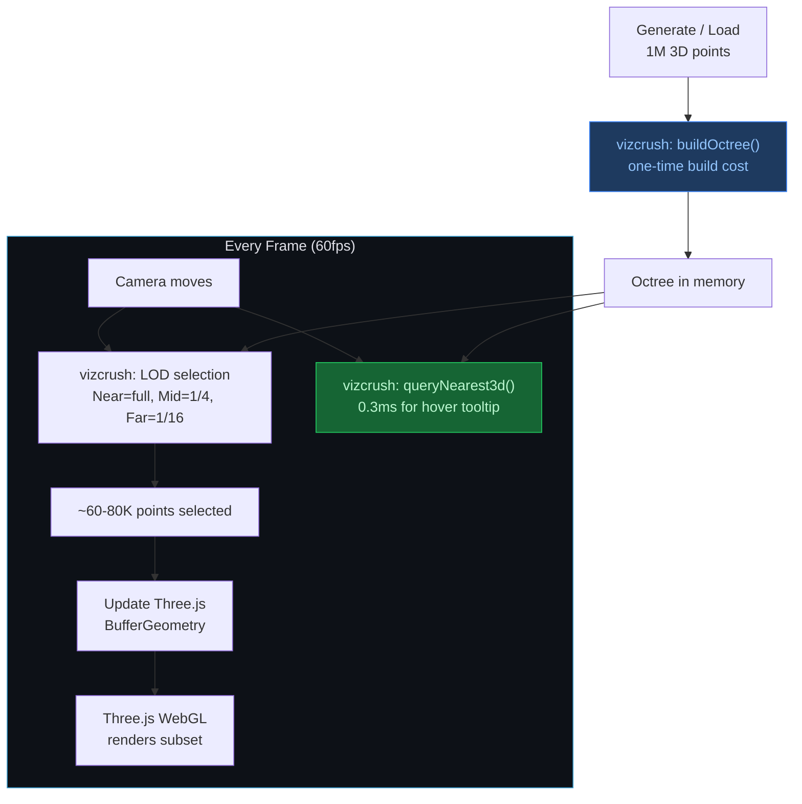
